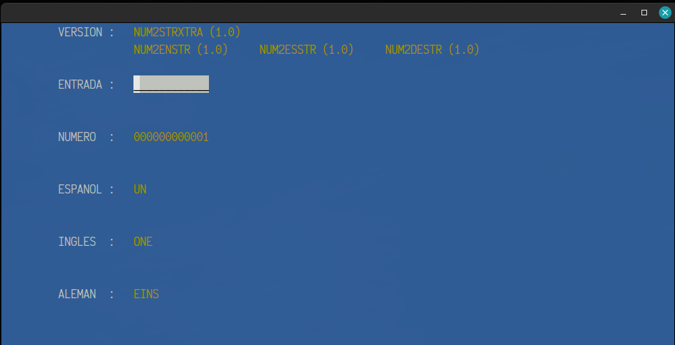

# COBOL Ejemplos

| Command                             | Description             |
| ----------------------------------- | ----------------------- |
|  ./SCRIPTS/RELEASE/list.sh          | List apps availables    |
|  ./SCRIPTS/RELEASE/lib.sh           | Compile Libraries       |
|  ./SCRIPTS/RELEASE/run.sh {APP}     | Execute {APP}           |
|  ./SCRIPTS/RELEASE/compile.sh {APP} | Compile {APP}           |

| Command                             | Description             |
| ----------------------------------- | ----------------------- |
|  ./SCRIPTS/TEST/list.sh             | List apps availables    |
|  ./SCRIPTS/TEST/lib.sh              | Compile Libraries       |
|  ./SCRIPTS/TEST/run.sh {APP}        | Execute {APP}           |
|  ./SCRIPTS/TEST/compile.sh {APP}    | Compile {APP}           |

## Rutinas de Monto Escrito

